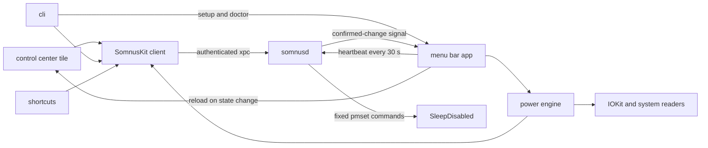

# how it's built

somnus is split in two. the app you run handles the battery safety net. a small root helper does the one thing that needs root, which is changing `SleepDisabled`.



## the parts

| target | what it is |
|---|---|
| `Somnus` | the menu bar app. it owns the settings, the battery safety net, ac-aware mode, notifications, the login item and the quit prompt |
| `SomnusKit` | the code the app, the cli and the tile share, including the helper client and the Shortcuts actions |
| `somnusd` | the root helper that launchd runs. it runs `pmset` one job at a time and remembers the app's last check-in |
| `somnus` | the cli, which lives inside the app at `Somnus.app/Contents/Helpers/somnus`. it has no special rights of its own |
| `SomnusControl` | the Control Center tile, a sandboxed WidgetKit extension |

## the helper

before the helper answers anyone, it checks their code signature, bundle id and user. only root or the person logged in at the screen can talk to it, and only with an app signed by the same team as the helper. everyone else is turned away.

the helper only knows a handful of calls. it runs `pmset` with fixed arguments and a timeout, and it reads the setting back after every change. it never runs anything a client sends it. it refuses to turn stay awake on unless the app has checked in recently with its safety net armed. turning stay awake off always works, and if several off requests arrive while one is still waiting, they share one write.

release builds keep the hardened runtime and leave out Xcode's debug-only `get-task-allow` entitlement. if the app finds an older helper, it offers to repair it from the menu and from settings.

setup and diagnostics run through the installed app, because macOS ties the helper and notifications to `/Applications/Somnus.app`. the cli just starts the app in a special mode and passes your terminal through. the scripts never copy anything into `/Library/LaunchDaemons` and never set up a way to get root without a password.

the helper protects you from other users and unsigned code. it can't protect you from your own account, because anything running as you can run the signed cli too.

## the power engine

the app looks at the battery level, the power source, `SleepDisabled`, your settings and what the safety net did last, all in one queue. if several updates arrive at once they're merged into one pass.

the safety net can warn you, turn stay awake off, retry a write that failed, follow the power cable in ac-aware mode and re-arm when you turn stay awake back on. when the net turns stay awake off and the helper confirms it, the app remembers that it did. once the battery is 5% above the off level, the app turns stay awake back on, charging or not. if you turn stay awake off yourself, even when it was already off, the app forgets. it also forgets when it restarts. if turning stay awake back on fails, the app tries again a minute later.

the engine wakes up when the power source changes or the helper confirms a change. it also checks every five minutes and after the macbook wakes, just in case. there's no fast polling loop.

## the heartbeat

every 30 seconds the app checks in with the helper. it also checks in straight away whenever the safety net, battery monitoring, ac-aware mode or the mode changes. the helper keeps the last check-in in memory and treats it as stale after 90 seconds.

without a fresh check-in the helper won't turn stay awake on, and its watchdog turns stay awake off. it acts once each time protection is lost, and a new armed check-in resets it. launchd starts the helper when the macbook boots and restarts it if it ever exits, because `SleepDisabled` survives both. so if the app hasn't checked in within 90 seconds of the helper starting, stay awake goes off. the watchdog doesn't know who turned stay awake on, so it also turns off a `SleepDisabled` you set yourself with `pmset` if it's on when protection is lost.

when you quit the app normally it tells the helper it's stopping. if it crashes, the helper notices when the check-in goes stale and restores normal sleep.

## keeping everything in sync

after each successful write, the helper reads `SleepDisabled` back and sends a Darwin notification with nothing in it. when the app gets one, it reads the setting again, updates its idle assertions, runs the safety net and asks Control Center to reload the tile. the notification never carries the value, so a missed or merged one can't leave anything showing the wrong mode.

anyone on the macbook can send a Darwin notification, so somnus never treats one as permission to do anything. a fake one just causes an extra read, and bursts are merged and slowed down. a second notification tells the app you turned stay awake off, so it won't turn it back on by itself. faking that one can only keep your macbook on normal sleep.

the tile shows the app's last check-in next to a fresh read of `SleepDisabled`. the settings window uses the same data as the menu and refreshes when it opens, with no polling timer.

## data and logs

somnus has no analytics, no accounts, no updater and no network code. your settings are stored as macOS defaults under `com.z89.somnus`, and `defaults delete com.z89.somnus` clears them. the app only remembers a pending restore while it's running, and every decision reads `SleepDisabled` fresh. the helper's check-in record lives in memory and is gone when the helper restarts.

logs go to the unified log under `com.z89.somnus` and `com.z89.somnus.helper`.

```sh
log stream --predicate 'subsystem BEGINSWITH "com.z89.somnus"'
```

## checks

```sh
./scripts/test.sh            # isolated tests, nothing real is changed
./scripts/build.sh           # unsigned release build
./scripts/install.sh         # signed build, safe install or update, guided setup
./scripts/uninstall.sh       # back to normal sleep, then remove everything
./scripts/check-release.sh   # whitespace, plists, docs, tests, build and analyze
```

ci runs the docs check on Linux and the release check on a macOS 26 runner. the tests never change your power settings or put the macbook to sleep. anything that touches power or root needs a clear way to fail and a way back to normal sleep.

## releasing

releases are source only for now. bump `MARKETING_VERSION` and `CURRENT_PROJECT_VERSION` in `Config/Shared.xcconfig`, which every target uses, update the changelog and run the release check on macOS 26. then install it and try helper install, repair, doctor, the tile, Shortcuts, ac-aware mode, the quit prompt and a real closed lid before you tag it.

a downloadable app needs the paid Apple Developer Program, a Developer ID certificate, the hardened runtime and notarization. none of that is set up yet, so a build signed with an Apple Development certificate is never a release.

## security

if you find a way past the helper's checks, a way to make it run something else, a failed write that's reported as done, or a way to leave `SleepDisabled` stuck on, please report it privately through [GitHub's security advisory form](https://github.com/z89/somnus/security/advisories/new) instead of opening a public issue.
