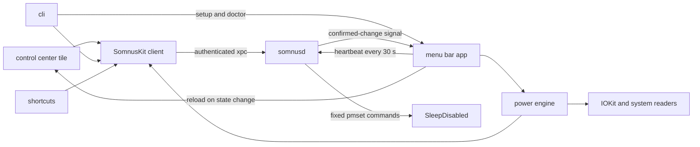

# how it is built

battery policy lives in the user's app. the one privileged operation, writing `SleepDisabled`, lives in a small root helper with a fixed api.



## components

| target | what it is |
|---|---|
| `Somnus` | the menu bar app: settings, battery policy, ac-aware mode, notifications, the login item and the quit guard |
| `SomnusKit` | the xpc client, shared models and the Shortcuts actions, used by the app, the cli and the tile |
| `somnusd` | the launchd root helper. it runs `pmset` one job at a time and keeps the latest app heartbeat in memory |
| `somnus` | the cli, embedded at `Somnus.app/Contents/Helpers/somnus`. it has no privileged code of its own |
| `SomnusControl` | the Control Center tile, a sandboxed WidgetKit extension |

## the privileged boundary

the helper checks each caller's code signature, bundle id and effective user. the caller must be root or the active console user, and signed by the same team as the helper, or the connection is dropped. the xpc api is a handful of calls, the `pmset` arguments are fixed, every command has a timeout and every write is read back. the helper never runs text a client sends it. a request to turn stay awake on is refused unless the app has a fresh, armed safety heartbeat; a request to turn it off is always allowed. release builds keep the hardened runtime and leave out Xcode's debug-only `get-task-allow` entitlement.

clients check the helper's version before using newer calls, and an old helper gets a repair offer in the menu and in settings.

setup and diagnostics that depend on `SMAppService` run through a one-shot mode of the installed app's executable. the cli only locates that executable and forwards the terminal's input and output. this keeps service ownership, notification identity and the code-signing context attached to `/Applications/Somnus.app`. the scripts never copy a daemon into `/Library/LaunchDaemons` and never create a passwordless privilege path.

the boundary protects against other users and unsigned code, not against your own session. anything already running as you can run the signed cli and change the setting too.

## the power engine

battery level, power source, `SleepDisabled`, preferences and the last policy stage are evaluated on one serialized path. overlapping refreshes coalesce, but a caller waiting on fresh data waits for the queued pass. lifecycle checks stop an old task from acting after monitoring has stopped.

the policy can warn, turn stay awake off, retry a failed write, follow ac power and re-arm once stay awake is turned on again. the running app records restoration ownership only after a safety-net off write has been independently confirmed. at the off threshold plus 5% it restores stay awake whatever the power source. an explicit off cancels ownership even when the mode was already off, and ownership is never carried across an app restart. a failed restoration keeps ownership and retries with a bounded back-off.

power-source events and confirmed stay-awake writes drive the engine. a five-minute evaluation and a refresh after wake are the fallback; there is no short polling loop.

## the tile and the heartbeat

every 30 seconds the app renews a liveness lease with the helper. changes to the net, monitoring, ac-aware mode or the mode itself are reported immediately through Swift observation; the timer is not how they are found. the helper keeps the report in memory and treats it as stale after 90 seconds. without a fresh lease it refuses new on requests, and its watchdog restores normal sleep if stay awake outlives its protection. launchd starts the helper at boot, because `SleepDisabled` survives a restart: if the app has not reported within 90 seconds, the watchdog turns stay awake off. while somnus is installed this also applies to a `SleepDisabled` set by hand with `pmset`. the tile shows the report next to a live `SleepDisabled` read.

after every successful write, `somnusd` reads `SleepDisabled` back and then posts a payload-free Darwin notification. the app treats it only as an edge: it re-reads the setting, reconciles its idle assertions, evaluates the battery policy and asks Control Center to reload. coalescing cannot produce stale state, because neither the notification nor the tile carries a copy of the value.

Darwin notification names are public, so these signals are never trusted as authorization. a spoofed change signal can only cause another read, and bursts are coalesced and throttled so they cannot build an unbounded queue. a separate safe-direction signal cancels automatic restoration after an explicit off, including a redundant off that changed nothing; spoofing it can only keep normal sleep on.

the settings window reads the same observable engine and installation models as the menu and refreshes once when it opens. it has no polling timer. IOKit power events, the helper's confirmed-write signal, app activation and an explicit refresh drive it.

a normal quit sends a final not-running report. after a crash the helper restores normal sleep, and macOS shows the live state the next time it redraws the tile.

## data and logs

somnus has no analytics, accounts, updater or network client. preferences are stored as macOS defaults under `com.z89.somnus`, and `defaults delete com.z89.somnus` removes them. restoration ownership lives only as long as the app process, and every decision reads `SleepDisabled` live. the heartbeat is held in the helper's memory and is gone when the helper restarts.

logs go to the unified log under the `com.z89.somnus` and `com.z89.somnus.helper` subsystems:

```sh
log stream --predicate 'subsystem BEGINSWITH "com.z89.somnus"'
```

## checks

```sh
./scripts/test.sh            # isolated tests; nothing real is written
./scripts/build.sh           # unsigned release build
./scripts/install.sh         # signed build, safe install or update, guided setup
./scripts/uninstall.sh       # disarm, unregister, then remove the exact install paths
./scripts/check-release.sh   # everything: whitespace, plists, docs, tests, build, analyze
```

ci runs the documentation check on Linux and the release check on a macOS 26 runner. the tests never change the host's power setting or ask it to sleep. anything that touches power or privilege needs a clear failure path and a way back to normal sleep.

## releasing

releases are source only for now. bump `MARKETING_VERSION` and `CURRENT_PROJECT_VERSION` in `Config/Shared.xcconfig`, which every target inherits, update the changelog, and run the release check on macOS 26. then install with the installer and try helper install, repair, doctor, the tile, Shortcuts, ac-aware mode, the quit guard and a real closed lid before tagging.

a downloadable app needs the paid Apple Developer Program, a Developer ID certificate, the hardened runtime and notarization. none of that is set up yet, so a build signed with an Apple Development certificate is never a release.

## security

if you find something that gets past the helper's authentication, widens what it will run, reports a failed write as done or leaves `SleepDisabled` stuck on, follow the [private reporting policy](../SECURITY.md) rather than opening a public issue.
